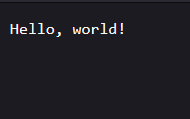
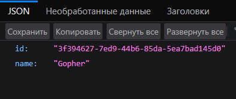
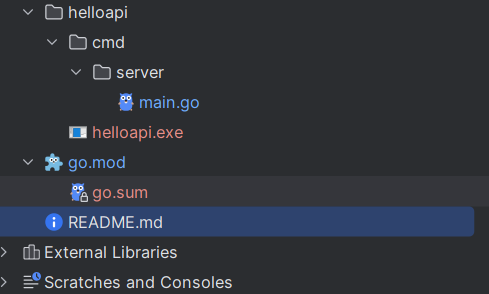

# Практическая работа №1
## Выполнил: Туев Д. ЭФМО - 01

# Описание проекта
Данный проект предназначен для пробного развертывания самописного сервера на ЯП Go.
# Требования к проекту
- Предусмотрена возможность свободного клонирования с Git
- Сборка и компиляция выполняется успешно
- Запуск без компиляции и скомпилированного файла выполняется успешно
- Сервер разворачивается на порту 8080 и отдает запрашиваемые данные по endpoint`ам /hello и /user
# Для разработчика
## Версия
Версия Go в проекте используется следующая:

## Сборка
Для сборки проекта необходимо выполнить команду из директории helloapi:
```
go build -o executableFileName.exe ./cmd/server
```
## Запуск
Для запуска без компиляции выполняется команда из директории helloapi:
```
go run ./cmd/server
```
Для запуска скомпилированного файла выполняется команда из директории helloapi:
```
.\executableFileName.exe
```
## Проверка работоспоcобности
Для проверки работоспособности необходимо обратиться к разворачиваему API с помощью:
```
curl http://localhost:8080/hello
curl http://localhost:8080/user
```
При обращению по первому адресу результат должен быть такой:


При обращении по второму адресу результат должен быть аналогичный:

# Структура проекта

